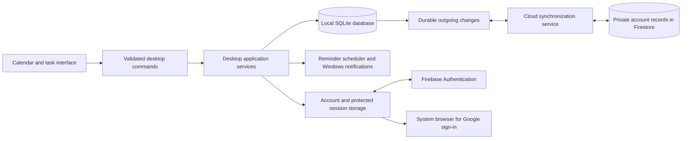

# C.C. Lime — project plan and product specification

**Version:** 1.0 · **Prepared:** September 17, 2026 · **Stage:** planning, before application implementation.

This document defines the first release of C.C. Lime. The implementation sequence is in [the task register](docs/IMPLEMENTATION_TASKS.md); the required verification scenarios are in [the acceptance test specification](docs/ACCEPTANCE_TESTS.md). Together these are the project plan. Requirements use `R-` identifiers, implementation tasks use `T-` identifiers, and acceptance tests use `A-` identifiers so completion can be traced to evidence.

The plan makes behavior and completion criteria explicit. It cannot guarantee error-free software: unknowns must be resolved through the technical checks and release tests below. A test that has not been performed must be marked **not run**, never assumed to pass.

## 1. Confirmed decisions

| ID | Decision confirmed by the owner | Release commitment |
| --- | --- | --- |
| R-01 | Name: **C.C. Lime** | Use this exact display name in the app, installer, shortcuts, notification identity, and documentation. Internal package name: `cc-lime`. |
| R-02 | Windows first, with a path to other desktop platforms | Deliver an installable Windows desktop application. Isolate platform-specific code to allow subsequent macOS and Linux releases. |
| R-03 | Data survives closing and reopening | Commit changes to a local database before confirming a save; restore data, settings, and the previous view on launch. |
| R-04 | Accounts and cloud sync across devices | Support one private calendar account on multiple Windows computers; retain useful functionality without an internet connection after initial sign-in. |
| R-05 | Email/password and Google sign-in | Implement both methods, email verification, password reset, persistent sessions, and safe account linking. |
| R-06 | Reminders while open or in the background | Use native Windows notifications and a tray process. Provide an optional start-at-login setting. |
| R-07 | Black and purple UI | Use a dark calendar interface with purple accents; the word “Lime” does not change the requested color scheme. |
| R-08 | A regular calendar with events beneath each date | Month view is the default home screen. Events and deadlines appear inside their calendar days. |
| R-09 | Clicking a day expands it | Open an inline, detailed day panel beneath the selected week. Preserve the surrounding month and selected-day context. |
| R-10 | Sidebar with upcoming tasks for seven days | Show incomplete assignments, exams, study sessions, and personal tasks due today through six days from today. |
| R-11 | Full student toolkit | Include semesters, courses, recurring classes, assignments, exams, study sessions, and task completion. |
| R-12 | Calendar-file import and export | Import and export `.ics` files. Include a separate full-fidelity local backup format. |
| R-13 | Free cloud tier initially; ask before spending | Use a no-cost cloud plan. No paid upgrade, paid signing certificate, domain purchase, or paid service is authorized by this plan. |
| R-14 | Additional UX decisions delegated to planning | Adopt the explicit defaults and improvements below without further routine design questions. |

## 2. Release boundaries and success criteria

### 2.1 What the first release contains

The release is a complete desktop workflow: install → sign in → create a semester and courses → schedule classes and deadlines → receive reminders → close and reopen → continue offline → reconnect and sync to a second installation.

Required outputs are source code, a Windows installer, reproducible build instructions, database migrations, cloud configuration/rules/index definitions, import/export support, a user guide, and a release verification report. A browser preview may help visual review, but it is not evidence that installation, tray behavior, or Windows notifications work.

The primary test target is Windows 11 x64. Windows 10 22H2 x64 is a compatibility target subject to verification against the selected Electron release and an actual installation test. The public compatibility statement must list only systems that have passed testing. Windows ARM64, older Windows versions, macOS, Linux, phones, and tablets are subsequent targets; x64 emulation on ARM is not a substitute for a tested ARM release.

End users must not need Node.js, a terminal, a development server, or the source repository. A first sign-in requires internet access. After that, saved local calendars and reminders remain available offline while the app is running.

### 2.2 Completion thresholds

- A fresh installation can create an account with each supported sign-in method.
- A saved item survives normal close, explicit quit, and a simulated unexpected process exit after the save acknowledgment.
- A second computer retrieves the same account's calendar, including recurrence exceptions and completed tasks.
- Offline changes retry automatically and cannot silently overwrite conflicting edits from another computer.
- The installed app can emit a native reminder while its window is hidden in the tray.
- Every calendar day can be expanded and operated with a mouse or keyboard.
- The seven-day sidebar uses a precisely defined date range and updates at midnight.
- Required acceptance scenarios pass, including account isolation, migration recovery, time-zone behavior, import duplication, and installed-app checks.

### 2.3 Deliberately deferred work

Direct Google Calendar/Outlook account integration, university SSO, timetable scraping, LMS integrations, shared calendars, meeting invitations, mobile apps, AI scheduling, file attachments, grade/GPA tracking, a Pomodoro timer, subscriptions, and automatic software updates are outside release 1. Google **sign-in** does not grant Google Calendar access.

Release 1 supports editing a single occurrence or an entire series. “This and all following occurrences” is deferred because splitting series while preserving exceptions and completion history needs a separate specification. The editor must not display a nonfunctional option for it.

## 3. Product defaults

| Setting | Initial value | Scope and behavior |
| --- | --- | --- |
| Home view | Month | Remember the last selected view and visible month on that computer. “Today” always returns to the current day. |
| Week starts | Monday | User can choose Sunday. This changes presentation, not recurrence rules. |
| Calendar time zone | Detected operating-system zone on onboarding | Save the named zone, such as `America/Toronto`. Keep it fixed until changed. An optional “follow this computer's time zone” setting is device-specific. |
| Time display | Operating-system 12/24-hour preference | Allow an explicit override. Store times independently of formatting. |
| App appearance | Black/purple dark theme | Course colors add small accents and labels without replacing the core theme. |
| Close button | Hide to tray | Explain this once. Tray menu includes a clearly labeled Quit action. |
| Start at login | Off | Offer during onboarding. Turning it on starts the app quietly in the tray. |
| Desktop reminders | On after the user enables them during onboarding | Provide a test notification and a settings route if Windows suppresses delivery. |
| Quiet hours | Off | User can set a start and end time, including a range crossing midnight. |
| Notification detail | Event title, time, and location | A privacy setting replaces details with “You have an upcoming item.” |
| Default class/event/study reminder | 15 minutes before | Copied into new items; changing the default does not rewrite existing reminders. |
| Default exam reminder | 1 day and 1 hour before | Up to five reminders per item. |
| Default assignment/personal-task reminder | 1 day before the deadline | Date-only deadlines use 09:00 in the item's time zone as their reminder anchor. |
| New timed event | 60 minutes | Start is the clicked slot or the next 15-minute boundary; an empty-day click selects the date without saving an item. |
| Upcoming sidebar | All courses, incomplete tasks | Its filter is independent of the month view's course filters and visibly labeled. |
| Destructive action undo | 10 seconds | Undo restores through the same data/sync path as other edits. |
| Automatic local backups | Once per day before the first mutation, plus before migrations | Retain seven daily snapshots and the latest pre-migration snapshot per account. These are local recovery copies. |

## 4. Screen and interaction specification

### 4.1 Main layout

Use a compact navigation rail on the left, the calendar in the center, and an upcoming-task sidebar on the right. The initial window target is 1440 × 900 logical pixels, capped to the available work area. Minimum normal window size is 900 × 640; content must remain reachable when display scaling reduces available space.

At widths of 1200 logical pixels or more, keep a roughly 72-pixel navigation rail and a 300–340-pixel sidebar visible. Below that width, collapse the sidebar into an accessible Upcoming button with a task-count badge. Opening it creates a drawer; it must not shrink calendar cells until their contents become unreadable.

Navigation destinations: Calendar, Tasks, Courses & Semesters, and Settings. The header contains C.C. Lime, previous/next period, Today, month/year, Month/Week/Agenda selection, Search, Add, and a concise sync indicator. The user menu contains account information and sign-out.

```text
┌─────────────────────────────────────────────────────────────────────────────┐
│ C.C. Lime    ‹  September 2026  ›  Today    Month ▾    Search    + Add        │
├───────┬───────────────────────────────────────────────┬─────────────────────┤
│       │ Mon   Tue   Wed   Thu   Fri   Sat   Sun       │ UPCOMING · 7 DAYS   │
│ Nav   │  7     8     9    10    11    12    13        │ Overdue, if any     │
│       │       9:00 Class     Assignment due           │ Today               │
│       ├───────────────────────────────────────────────┤ □ Assignment        │
│       │ Selected day: Thu, September 10               │ Tomorrow            │
│       │ All-day items and deadlines                   │ □ Study session     │
│       │ 09:00–10:00  Class · room                     │ □ Exam              │
│       │ 14:00–15:30  Study session                    │ ...                 │
│       │ + Add to this day                  Collapse   │ Saved on device     │
│       ├───────────────────────────────────────────────┤ Synced ... ago      │
│       │ Remaining weeks                               │                     │
└───────┴───────────────────────────────────────────────┴─────────────────────┘
```

This is a structural diagram, not a final visual mockup. Actual dates and events are user data; the production app starts empty.

### 4.2 Month calendar — R-08

Render seven columns and the four, five, or six complete weeks required by the selected month. Show adjacent-month dates with reduced emphasis. Clicking an adjacent-month date selects it and navigates to its month.

Each day shows its number, a today marker if applicable, and event rows. All-day items come first, followed by timed entries ordered by local start time, then title, then stable ID. Date-only deadlines appear in a labeled Deadlines group rather than at a fabricated 23:59 appointment time. Completed task entries remain available with muted styling and a completion mark; a visibility toggle can hide them.

Show up to three event rows in compact cells and four when space permits. Remaining items are represented by a “+N more” control, which opens that day's expansion. Do not use independent scrolling inside every day cell.

An event row displays time when relevant, title, course abbreviation or type icon, and completion status when relevant. Truncation must have a full accessible name and a tooltip. Color cannot be the sole way to distinguish a course, overdue task, selection, or conflict.

### 4.3 Day expansion — R-09

Clicking blank space or the date header of a day opens a full-calendar-width panel immediately below that day's week row. Only one day panel can be open. Selecting another day replaces the panel; selecting the same day header again collapses it. Clicking an event opens its details and does not accidentally toggle the parent day.

The panel contains the full date, previous/next-day controls, close control, add button, all-day/deadline section, and a timed breakdown. The timed breakdown uses a 24-hour time axis with an accessible chronological-list alternative. Initially scroll toward the current hour for today or the first event for another date. Overlapping events appear side by side and have an overlap label; no event is hidden behind another.

The panel scrolls internally above roughly 420 pixels of content. Opening it scrolls only enough to make the selected date and panel header visible. Closing it returns keyboard focus to the date that opened it. Escape closes the topmost overlay first, then the expanded day. An event editor with unsaved changes uses a discard/keep-editing prompt rather than silently closing.

### 4.4 Seven-day sidebar — R-10

“Next 7 days” means **today plus the next six calendar dates** in the effective display time zone. The range is `[start of today, start of today + 7 calendar days)`, not the next 168 elapsed hours. It always follows today even if the user browses a different month.

Include incomplete assignments, personal tasks, exams, and study sessions whose due date or scheduled start falls in this range. Classes and ordinary non-task events remain on the calendar; a separate small “Next event” card may show the nearest one without turning every class into a task.

Overdue incomplete items appear in a separate section above the seven-day groups and are not repeated below. Show five initially with “Show all overdue.” Within each date, timed items sort by due/start time; date-only tasks follow timed items; ties sort high/normal/low priority, then title, then ID. No-due-date tasks appear in the Tasks screen's Unscheduled section, not under an invented day.

For timed tasks, overdue begins when the due instant is earlier than now. For date-only tasks and date-only exams, overdue begins at the next midnight in the item's own time zone. Timed exams and study sessions become overdue after their end time if still incomplete. Recalculate on item changes, completion, sync, time-zone changes, resume, and at midnight. Clicking a checkbox completes the item without opening a day; clicking its title opens details. Offer Undo for completion.

### 4.5 Secondary views and search

Week view offers a seven-day timetable with the same event data and overlap treatment. Agenda view offers an accessible chronological list grouped by date, initially covering 30 days with “Load next 30 days.” Neither view creates separate records.

Search covers title, course name/code, location, and plain-text notes. Debounce input by 200 ms; show the search date range and filters. Default occurrence search covers the prior 90 days and next 365 days, with a user-adjustable range. Series titles can still be found outside that range as series results. Search must not expand an unlimited recurrence into an unlimited list.

Keyboard actions: Ctrl+N adds an item, Ctrl+F focuses search, Ctrl+T goes to today, arrows move calendar focus, Enter expands a day, and Escape closes the active layer. Do not trigger global shortcuts while typing into a text field unless the shortcut is explicitly relevant there.

### 4.6 Visual design and accessibility — R-07/R-14

Initial design tokens: page `#09070F`, primary surface `#15101F`, raised surface `#20182E`, border `#3B2C4E`, main text `#F7F3FF`, muted text `#B9ADC9`, primary purple `#8B5CF6`, selected fill `#35204F`, and focus ring `#C4B5FD`. Validate actual foreground/background combinations; adjust tokens where necessary to meet contrast requirements.

Use a system sans-serif stack with Segoe UI on Windows. Default body text is 14–16 pixels with readable line height. Controls have visible focus, labels, and at least 32-pixel practical hit areas; primary controls target 40 pixels. Use approximately 12-pixel corner radii on panels and 8 pixels on inputs. Motion lasts 120–180 ms and is disabled or simplified when reduced motion is requested.

Target WCAG 2.2 AA for applicable desktop web-content interactions: normal text contrast at least 4.5:1, large text and meaningful UI boundaries at least 3:1, visible keyboard focus, meaningful reading order, no color-only information, and accessible dialog focus handling. Verify keyboard use, Windows Narrator, and 200% zoom; do not claim conformance solely from an automated checker. [W3C accessibility criteria](https://www.w3.org/TR/WCAG22/)

## 5. Student information and scheduling rules — R-11

### 5.1 Semesters and courses

A semester has a name, start date, end date, and time zone. End date must be on or after start date. Provide optional inclusive date ranges for reading week and other breaks. Courses have a name, optional code, optional instructor, optional default location, color, and semester association.

A class series inherits semester bounds and its time zone on creation, with a preview of meeting dates. Each meeting pattern is a separate series: a Monday lecture at 09:00 and a Wednesday lab at 14:00 are distinct patterns linked to one course. This avoids an opaque recurrence rule with multiple meanings.

Semester-bound classes skip configured breaks by default. The creation screen displays that choice. Changing semester dates or breaks later previews affected class occurrences and requires the user to apply the timetable change; assignments and exams are not automatically shifted. Archiving a course or semester hides it from default course navigation while retaining its records and existing reminders. Archiving must never silently delete scheduled work.

### 5.2 Item types

| Type | Required timing | Completion | Typical extra fields |
| --- | --- | --- | --- |
| Class | Timed start/end; optional recurrence | No attendance tracking in release 1 | Course, room, lecturer, notes |
| General event | Timed or all-day range; optional recurrence | No | Location, notes |
| Assignment | Due date, optional due time; may be left unscheduled | Open / in progress / completed | Course, priority, estimated effort, notes |
| Exam | Timed start/end or date-only exam | Open / completed | Course, location, notes |
| Study session | Timed start/end; optional recurrence | Open / completed per occurrence | Course, optional linked assignment, notes |
| Personal task | Due date/time optional | Open / in progress / completed | Priority, estimated effort, notes |

Assignments and personal tasks are nonrecurring in release 1. A recurring study session has completion state per occurrence. Completing an assignment does not automatically complete or delete its linked study sessions; offer an explicit action to review remaining sessions.

### 5.3 Editor, validation, and limits

Required title: 1–200 characters after trimming. Notes: plain text, at most 10,000 characters. Location: at most 300 characters. Course code: at most 30 characters. Reject invalid dates and time-zone identifiers; prevent a timed end at or before its start. A midnight-crossing event must visibly show its end date. All-day end dates are stored exclusively: a one-day event starting September 10 ends at September 11's date boundary.

Support scheduling years 1900–2100. Limit reminders to five per item, each from zero to 30 days before its anchor. Estimated effort accepts 5 minutes through 100 hours. Priority is high, normal, or low. These rules apply in the editor, desktop command boundary, import validator, local repository, and cloud validation where expressible.

Saving runs validation, commits locally, then reports “Saved on this device.” If online sync subsequently succeeds, show “Synced.” A network outage must not make a successful local save look like a failure. A local disk failure must not produce a success message.

Offer duplicate, delete with Undo, mark complete, and a “Schedule study time” action on assignments. The latter opens a normal study-session editor with the assignment linked; it never allocates time automatically. Overlap warnings are informative and do not prevent a student from knowingly scheduling overlapping items.

Drag and drop is a convenience, not the only editing method. Moving a month event changes its date while preserving local start time and duration. Moving a date-only task changes its due date. Week-view movement snaps to 15 minutes, and resizing is only available for timed-duration items. Every recurrence move asks whether it affects this occurrence or the series before saving.

## 6. Recurrence, time zones, and date correctness

Use a tested calendar parser/recurrence library and a named-time-zone library. Domain logic must not implement dates by adding fixed 24-hour millisecond intervals or parse a date-only string as a UTC timestamp.

Native recurrence supports daily, weekly with selected weekdays, monthly by date or ordinal weekday, and yearly by month/day. Interval is 1–52. End conditions are semester end, an explicit final date, an occurrence count of 1–999, or no end. Monthly dates that do not exist are skipped; a February 29 yearly series occurs in leap years. Never silently move these to a different date.

Native meeting series generate at most one occurrence per local calendar date. Store the original local occurrence date as the stable key alongside the series ID. A moved occurrence keeps its original key, even when its actual date changes. Imported recurrence with multiple occurrences per day requires explicit finite-range conversion or is reported unsupported.

Store timed instants in UTC with the original IANA time zone and intended wall-clock representation. For recurring classes, the named zone plus local meeting time defines future occurrences; a 09:00 class stays at 09:00 through daylight-saving changes. Timed recurring duration is elapsed minutes, so a session that itself spans a clock change retains its elapsed duration and displays the resulting local end time. All-day recurring duration is a count of calendar dates. Store all-day/date-only values as dates, separately from instants.

A manually entered nonexistent local time is rejected with an explanation and valid choices. A repeated local time during a clock rollback requires a visible offset choice, defaulting to the earlier occurrence. For a recurring series, skip nonexistent local times in accordance with the calendar recurrence rules, and indicate that skipped date in the preview. An ambiguous recurrence uses the earlier occurrence consistently. Verify these behaviors against RFC 5545 and actual library output. [Recurrence standard](https://datatracker.ietf.org/doc/html/rfc5545)

“This occurrence” stores an exception rather than rewriting the series. Exceptions can cancel, move, or override title, timing, location, notes, and reminder settings. Completing a recurring study session stores a separate occurrence-state record. An entire-series edit preserves explicit exceptions. If changing a recurrence rule would remove dates with exceptions or completion history, block the save until the user chooses to retain those affected items as standalone records or explicitly discard them after a preview.

Expansion is bounded to the requested screen range or reminder horizon. Query moved exceptions by their effective date as well as their original occurrence key, so moved items can appear outside their original month. Preserve deterministic ordering when several items have identical timestamps. Time-zone changes alter the display of absolute timed events; they must not rewrite their stored instant. An explicit series-time-zone change presents a preview of the changed schedule.

## 7. Reminder contract — R-06

### 7.1 When reminders are possible

| Computer/app state | Expected behavior |
| --- | --- |
| App window visible, computer awake | Scheduler emits due notifications. |
| Window hidden, app running in tray | Same scheduler behavior; no renderer-window timer dependency. |
| App explicitly quit | No reminders until the app starts again. Quit explains this on first use. |
| Laptop sleeping or powered off | No claim of on-time delivery. On resume/start, apply the catch-up policy below. |
| Windows notifications or Do Not Disturb suppress banners | Preserve the reminder in the in-app inbox. Do not bypass Windows settings or claim the user saw it. |
| Offline with previously saved data | Local reminders continue for saved items. A remotely created event cannot remind this device before it syncs here. |
| Signed out | Stop scheduling that account's notifications and clear queued native objects owned by the app where supported. |

Native Windows notification identity and installed Start Menu integration are part of packaging, not a late cosmetic detail. Test notification click handling in the installed build. [Electron notification requirements](https://www.electronjs.org/docs/latest/tutorial/notifications)

### 7.2 Scheduling and duplicate handling

The desktop main process owns one scheduler per active account. It computes a rolling 30-day event-occurrence horizon, which covers the maximum 30-day reminder offset; include the boundary with a small overlap and de-duplicate by identity. Keep a durable journal and use the nearest-due timer with a maximum 60-second reconciliation interval. Rebuild after saves, sync, cancellation, completion, preference changes, startup, resume, and clock/time-zone changes.

Timed events use their start instant as the reminder anchor; timed assignments/personal tasks use their due instant. All-day events and date-only exams use 09:00 on their first date in their own time zone. Date-only assignments/personal tasks also use 09:00 on the due date. A reminder labeled “at deadline” for a date-only item must instead read “on the due date at 09:00” so the user is not given a false due time. An unscheduled task keeps its reminder preferences inactive until a due date is assigned. The date-only anchor time can be changed per item.

Identity is `(account, device, item/series, original occurrence key, reminder rule ID)`. Store the current due instant and reminder schedule revision separately. A title or note edit must not re-arm an already emitted reminder. A timing or reminder-rule change re-arms it only when the new trigger is in the future. Deleted, canceled, and completed items cancel pending notifications. Reopening a completed item only schedules triggers still in the future.

Persist `pending`, `dispatching`, `emitted`, `failed`, `suppressed`, `dismissed`, or `snoozed` state. There is no transaction spanning the database and Windows notification display, so exactly-once visual delivery cannot be guaranteed after a crash. If startup finds `dispatching`, preserve the reminder as delivery-uncertain in the inbox without automatically creating a duplicate popup. Show errors honestly; “emitted” means submitted to the operating system, not read by the user.

### 7.3 Catch-up, quiet hours, and actions

After resume/start, inspect unhandled reminders due during the prior 24 hours. Include still-relevant items: future or ongoing events and incomplete deadlines; past finished ordinary events are inbox history only. If more than three eligible reminders were missed, show a single summary notification opening the inbox. Older missed reminders remain discoverable in history without a notification storm.

Quiet hours suppress native banners, not inbox entries. At the next quiet-hours end while running, show one summary of still-relevant suppressed reminders. App-level snooze is available for 5, 10, 15, 30, or 60 minutes and persists across restart. Notification clicks bring C.C. Lime forward and open the relevant item or inbox entry. Snooze and Complete are always available inside the app; native toast action buttons are not required for cross-platform parity.

Multiple signed-in computers may each remind independently when awake. Completion sync cancels future reminders on other devices once the update arrives. Do not claim perfect cross-device deduplication when a device is offline.

Retain detailed notification history for 90 days locally. Compact older entries into identity-only delivery markers, retained until that local account is removed, so a large backward clock change does not replay previously delivered instances. Prune detailed journal content only after it falls outside both the catch-up window and all active scheduling horizons; retain active snoozes and future pending entries regardless of creation date.

## 8. Technology and responsibility boundaries

| Layer | Planned technology | Purpose |
| --- | --- | --- |
| Desktop runtime | Electron, current supported stable release pinned during T-02 | Windows installer, native notifications, tray, startup integration, secure session storage. |
| Build/package | Electron Forge with the Squirrel.Windows maker | Produce a conventional per-user installer and consistent shortcut/notification identity. |
| Interface | React + TypeScript + Vite; CSS design tokens | Calendar, task views, accessible forms, reusable components. |
| Local persistence | SQLite through a maintained Electron-compatible binding, initially `better-sqlite3` | Transactional storage and a durable outgoing-change queue. Verify native-module packaging before committing the rest of the implementation to it. |
| Calendar dates | `ical.js` for iCalendar/recurrence and Luxon for named-zone presentation/validation | Standards-based recurrence plus explicit local/UTC conversions. Pin only after DST fixtures pass. |
| Authentication | Firebase Authentication REST APIs | Email/password, verification, recovery, Google credential exchange, token refresh, and account linking without browser-stored credentials. |
| Cloud data | Cloud Firestore Standard on Firebase Spark | Per-account records protected by security rules; no separate paid application server. |
| Google sign-in | System-browser installed-app OAuth with PKCE | Receive a one-time result on a temporary loopback listener, then exchange the credential for a Firebase session. |
| Verification | Vitest, Testing Library, Playwright/Electron, Firebase emulator rule tests, installed Windows checks | Business rules, UI behavior, sync/security integration, and real operating-system behavior. |

Dependencies and runtime versions will be recorded in a lockfile and the release report after compatibility testing. “Latest” is not a reproducible dependency version. No package requiring a paid calendar-widget license is included.



Only the desktop service layer reads files, accesses credentials, performs cloud calls, and controls native features. The UI receives typed records and status messages, not raw filesystem, database, or shell access.

Use Firebase ID tokens for Firestore user requests so security rules are enforced. An administrator/service-account credential must never be packaged in the application. [Firestore REST authorization](https://firebase.google.com/docs/firestore/use-rest-api)

## 9. Accounts and session lifecycle — R-04/R-05

Email registration collects email and password with password confirmation, inline validation, and show/hide controls. Initial policy: minimum 12 characters, maximum 128, with password-manager paste allowed. Configure the cloud provider to enforce the same minimum. Enable email-enumeration protection and use generic recovery responses. Verification emails and password reset use Firebase's managed action pages initially; after completing them, the user returns to the app and selects “I've verified my email” or signs in again.

Unverified email accounts can save locally after registration, but cloud record access requires a verified email. Show a persistent verification prompt and queue local changes until verification succeeds. Google accounts must meet the provider's verified-email requirement before cloud sync is enabled.

Google sign-in opens the default system browser, requests only identity scopes (`openid`, `email`, `profile`), and never asks for calendar or Drive access. Use a fresh random state, PKCE S256 verifier/challenge, and OpenID nonce. Bind the callback listener only to `127.0.0.1` on a random available port and close it on success, cancellation, or five-minute timeout. Validate the callback path and state; validate the returned identity using a maintained OIDC library and the expected issuer, audience, nonce, and expiry. Register the desktop client ID with the Firebase Google provider as required by the actual provider configuration. Verify the complete exchange in T-04 before building downstream account flows. [Google installed-app authentication](https://developers.google.com/identity/protocols/oauth2/native-app)

Refresh tokens are encrypted with Electron's OS-backed safe storage; short-lived tokens remain in memory. Serialize refresh requests so concurrent cloud calls do not rotate or overwrite session state incorrectly. Atomically replace the encrypted session file before reporting a persisted sign-in. Do not store passwords, refresh tokens, or Google credentials in ordinary local storage, logs, source code, or exported backups. If secure storage is unavailable, offer a session that is not remembered rather than silently persisting plaintext. Windows safe storage protects against other Windows users, not arbitrary software already running as the same user. [Electron safe storage](https://www.electronjs.org/docs/latest/api/safe-storage)

Maintain separate local databases per Firebase user ID. On restart, a remembered previously authenticated session may open its existing local database offline. Explicit sign-out removes usable session credentials, stops sync and reminders, and requires online authentication before that account can be reopened. Retain its database by default so unsynced work is not lost; offer a separate, explicit “Remove this account's data from this computer” action. Never show the prior user's records while a different user signs in.

If the same email is used with both providers, use Firebase's account-linking flow after proving ownership of the existing account. Never merge records by comparing email strings. Linking must preserve the existing user ID and its records. Reject attempts to link a provider already attached to a different account, and explain the next recovery step. [Firebase authentication and linking endpoints](https://firebase.google.com/docs/reference/rest/auth)

Account deletion requires recent authentication and an explicit destructive confirmation. Keep a deletion-in-progress marker, stop normal mutations, remove cloud records/receipts/settings in resumable batches, verify they are gone, and only then delete the authentication identity. If interrupted, resume cleanup on the next authenticated connection. Delete local account caches after cloud deletion succeeds; explain that already exported backup files are separate copies. This client-driven cleanup must be tested under interruption because the no-cost architecture does not assume a paid background function.

## 10. Local data model and persistence — R-03

Local data belongs in Electron's per-user application-data directory under a stable C.C. Lime name, never inside the installation folder or project repository. Use one SQLite writer, enable foreign-key checking and WAL, and use durability settings appropriate to user-created records. Before acknowledging a mutation, commit the domain update and its outgoing queue entry in the same transaction.

| Record | Important contents | Rules |
| --- | --- | --- |
| Account profile/settings | User ID, display name, preferred week start, default reminders, calendar zone | No password/token fields. Separate synced preferences from device-only settings. |
| Semester | ID, name, inclusive date bounds, zone, break ranges, archived flag | Referenced courses retain their semester identity. |
| Course | ID, semester ID, name/code, instructor/location, color, archived flag | Deletion is blocked while items reference the course; offer archive. |
| Item | ID, type, title, course ID, notes, priority, timing variant, completion, reminder rules | A discriminated timing representation prevents date-only values being confused with instants. |
| Series fields | Local start date/time, elapsed duration minutes or all-day date count, zone, recurrence expression, bounds | Recurrence belongs to a master item; generated instances are derived views. |
| Occurrence exception | ID, series ID, original-date key, cancellation or override fields | Unique per series/key; original identity remains stable after a move. |
| Occurrence state | Series ID/key, status, completion timestamp | Completion of one session cannot complete the whole series. |
| Sync shadow | Last accepted remote body, version/update token, change sequence | Needed to compare offline edits with the last server version. |
| Outgoing mutation | Mutation UUID, account, entity, base version, local value, enqueue order, retry state | Written atomically with the local item. Immutable once sent; duplicate delivery uses the same ID. |
| Conflict | Base, local proposal, remote value/version, affected entity | No proposal discarded before an explicit resolution. |
| Notification journal | Device/item/occurrence/rule identity, due instant, dispatch/snooze state | Local to the device; separate from synced task completion. |
| Import batch/mapping | Batch ID, source UID mapping, hash, result counts | Duplicate detection and safe undo of the batch. |
| Schema metadata | Schema version, migration log, backup metadata | Migration failure preserves the previous data and recovery snapshot. |

Use UUIDs for new native records. Imported stable source IDs are mapped into local IDs; never use an imported UID directly as a filesystem path. Every synced entity has a schema version, remote revision, deleted/tombstone state, and remote change sequence. Index calendar range queries, due dates/status, course/semester links, exception effective dates, queue status, and reminder due instants.

Application failure modes must be explicit: an unwritable directory or full disk blocks the save and preserves the editor contents; database corruption opens recovery options without overwriting the damaged file; a migration failure restores the pre-migration database or leaves it untouched and explains the recovery path. Another process must not become a second uncontrolled writer; enforce a single app instance per Windows user.

## 11. Cloud synchronization protocol — R-04

### 11.1 Cloud structure and authorization

Store records below `/users/{uid}/records/{recordId}`, sync metadata below `/users/{uid}/system/sync`, and immutable mutation receipts below `/users/{uid}/receipts/{mutationId}`. A record includes an explicit entity type and validated payload. All ordinary reads/writes require an authenticated, verified user whose UID matches the path.

Security rules check field allowlists, types, string/array sizes, immutable identity, supported schema versions, revision progression, and permitted record kinds. Related references cannot point to another user's path. Use `getAfter` validations to tie a record mutation to its matching receipt and sync-head change in the same atomic commit. Test rule read-call limits using the actual commit shapes; a client-side validator is not an authorization boundary. [Firestore atomic-write rule validation](https://firebase.google.com/docs/firestore/security/rules-conditions)

### 11.2 Local save and outgoing queue

1. Validate the command and active account.
2. Start a local database transaction.
3. Apply the change and append an outgoing mutation with its base remote version.
4. Commit; only now tell the UI it is saved.
5. Schedule local reminders immediately, without waiting for the cloud.
6. Attempt cloud delivery if the session is verified and the connection is usable.

Only one outgoing mutation per account is in flight at a time. Additional edits to the same record form a local ordered chain. Edits never erase an in-flight payload. On acknowledgment, advance the shadow/base for the next mutation without overwriting a more recent local edit. Coalesce only mutations proven never sent.

### 11.3 Atomic cloud commit and recovery

For a normal single-record change, read the account's sync-head version and increment its logical sequence. Submit an atomic Firestore commit containing the changed record, an immutable receipt for the mutation UUID, and the new sync-head value. Each record update requires the exact remote version it was based on; a creation requires nonexistence. The sync-head update also requires its previously read version. Use a server timestamp for audit time, not the computer clock. [Firestore commits](https://firebase.google.com/docs/firestore/reference/rest/v1/projects.databases.documents/commit) and [write preconditions](https://firebase.google.com/docs/firestore/reference/rest/v1/Write)

If only the sync-head precondition loses a race, refresh it and retry. If the target record changed, create a conflict instead of applying a last-writer-wins overwrite. If the network response is lost, look up the same mutation receipt; its presence acknowledges the original operation without replaying it. Receipts include affected record IDs, resulting revision, and payload hash. Keep receipts and tombstones for the account lifetime in release 1 so an old offline client cannot resurrect deleted data.

Compound changes that must be inseparable use one atomic group with a common sequence, matching receipt, and all required preconditions. The planned maximum is four domain records plus one head and one receipt; T-05 must prove that exact shape fits the security-rule access budget before it is used. Semester-wide timetable changes and large imports are resumable batches with visible progress, not falsely advertised as one cloud transaction. Local import staging can still be atomic before its records enter the queue.

### 11.4 Pulling changes and convergence

Read a stable high-water sequence `N` from the account sync head. Fetch record pages whose last-change sequence is greater than the local cursor and at most `N`, ordered by sequence and record ID. Apply pages durably; advance the completed high-water cursor only after the bounded pass is complete. If a record moves to a sequence greater than `N` during the pass, it will be fetched in the next pass. A failed or interrupted page is replayable.

The first synchronization starts at zero and includes retained tombstones. On later syncs, fetch only changed records. Apply changes to the remote shadow before reconciling any local proposal. Keep local pending values intact. Stage related records before exposing a coherent update to the UI, and fetch any referenced record missing from the current local cache. Queries must use committed cloud data, not unacknowledged client cache state.

Foreground polling interval: 30 seconds. Tray-only polling interval: 120 seconds. Poll immediately after a local push, foreground activation, resume, reconnect, and explicit Sync now. One poll in progress suppresses overlapping polls. These are intended normal online convergence bounds, not guarantees during service outages or provider throttling.

Retry transient failures after approximately 2, 5, 15, 30, and 60 seconds, then at most every five minutes with jitter. Respect provider retry instructions. Authentication errors initiate one serialized refresh; revoked sessions require sign-in. Permission/schema errors stop the affected mutation and surface a repairable error instead of retrying forever. Quota errors retain all local data and explain that sync will resume when service capacity returns.

### 11.5 Conflict resolution

If the same record changes on two computers, show a comparison of the last shared version, this computer's change, and the cloud version. Choices are Keep mine, Use cloud version, or Keep both. Keeping both creates a new independent record with a new ID and its own reminders. Resolving against a newer cloud version rechecks that version; a second race reopens the conflict rather than silently overwriting it.

Deletion versus edit is also a conflict: offer Keep deleted or Restore as a new item. A tombstone must not be overwritten by an old client. Completion versus an unrelated change is initially treated as a record conflict rather than implementing an undocumented merge policy. Recurrence exceptions and completion-state records are independent entities to limit unnecessary conflicts.

Expose statuses in plain language: Saved on this device, Syncing, Synced with time, Offline—changes saved here, Sign in to resume sync, Needs review, and Sync unavailable. A visible count of pending changes and a Retry/Sync now action are required.

## 12. Import, export, and recovery — R-12

### 12.1 `.ics` import

Accept a selected local UTF-8 `.ics` file up to 10 MiB and 5,000 top-level calendar items per import. Parse in a worker so malformed or expensive files cannot freeze the window. Apply a bounded expansion budget of 20,000 occurrences for any preview; interrupt processing beyond the budget with a useful error.

Support normal `VEVENT` fields: UID, SUMMARY, DESCRIPTION, LOCATION, DTSTART, DTEND/DURATION, TZID, RRULE, RDATE, EXDATE, RECURRENCE-ID, and STATUS. Support `VTODO` with title, due date/time, and completion status. Treat actionable invitations, attendees, links, and attachments as data only; importing must never send invitations, email, or network requests. Only display notes as plain text.

Before committing, show counts for new, identical, changed, unsupported, and invalid items; preview representative dates/times; let the user select the destination course or General. Identical source UID/content combinations are skipped. A changed matching UID requires an explicit update-or-skip choice. Course labels are not inferred as authorization to alter unrelated existing items.

Floating times require selecting a time zone in the preview. Known IANA zones are preserved. Embedded custom `VTIMEZONE` definitions or recurrence forms that the native model cannot faithfully represent are reported; offer a deliberate finite date-range conversion to standalone occurrences where valid, otherwise skip the component. Never silently claim full recurrence preservation after flattening.

Calendar entries with no duration display the proposed app duration or date-only interpretation in the preview. Preserve original source data needed for duplicate detection. Import writes a durable batch record with result counts. Undo removes newly created items and restores changed values only if those values have not since changed; otherwise show the affected conflicts.

### 12.2 `.ics` export

Let the user select all calendar data or selected courses and an optional date range. Export valid UTF-8 with proper line folding, escaping, stable UIDs, explicit time-zone semantics, recurrence rules and exceptions where supported. Export ordinary deadlines as appropriately timed or all-day `VEVENT` entries for broad calendar compatibility; include `X-CCLIME-*` metadata for app-specific type/completion fields. Offer a task-oriented `VTODO` export separately if needed by the recipient.

An `.ics` file cannot preserve every C.C. Lime setting, relationship, or notification-history entry. Label it Calendar export. The full backup described next is the recovery format. Verify exports by reparsing them and opening representative fixtures in an independent calendar parser/client.

### 12.3 Full backup and restore

Provide a versioned JSON backup containing account-owned domain data, recurrence exceptions, completion states, preferences, and source mappings. Exclude passwords, tokens, cloud service credentials, device identifiers, and notification-delivery journals. Describe the exported file as containing private calendar information; do not pretend the file is encrypted.

Validate the entire backup, supported schema version, relationships, limits, and checksums before changing the database. Show a restore preview. Restoration merges into the signed-in account through the normal mutation queue; it never restores stale cloud cursors or mutation receipts. For a backup from another account, remap all entity IDs and relationships before importing. For the same account, detect conflicts and never bulk overwrite unseen cloud changes. Create a local recovery snapshot before applying.

## 13. Desktop lifecycle, packaging, and maintenance — R-02/R-06

Use a single-instance lock. A second launch brings the existing window forward. Closing the last window keeps the tray process alive according to the setting; Quit exits completely after finishing or safely persisting current local work. Tray menu: Open C.C. Lime, Add item, Pause reminders, Settings, and Quit.

Start-at-login is an explicit preference. Register the stable installed launcher with a background-start argument so versioned installation paths do not break startup after an upgrade. Reflect operating-system disabling of the startup entry in settings. [Electron login-item API](https://www.electronjs.org/docs/latest/api/app#appsetloginitemsettingssettings-macos-windows)

Package a per-user Windows installer with a Start Menu shortcut, app icon, and consistent notification identity. Build naming: `CC-Lime-<version>-Setup-x64.exe`. Set product name to C.C. Lime and keep internal executable/package identifiers simple. Handle installer lifecycle events so installing or updating does not accidentally start extra background processes. [Squirrel.Windows packaging](https://www.electronforge.io/config/makers/squirrel.windows)

Keep application data outside versioned install directories. Upgrading preserves data and preferences and takes a migration backup before changing schemas. Uninstall removes application binaries, shortcuts, and startup registration. Preserve user data unless the user has explicitly removed it through the app; explain the retained-data location in the guide.

Produce a locally downloadable installer as the required release artifact. A public download URL additionally requires an owner-controlled release host and an intentional publication step. Do not upload private calendar fixtures or credentials with release assets. Optional Windows signing is a separate release decision that may cost money; an unsigned build must be labeled accordingly, and no claim should be made that Windows will show no reputation warning. Automatic updates are deferred; manual updates use a new installer.

## 14. Free-tier cloud setup and ownership — R-13

Plan for **Firebase Spark**, which currently needs no payment method. Firestore's published free allocation includes 1 GiB stored data, 50,000 document reads/day, 20,000 writes/day, and 20,000 deletes/day. These are shared project quotas, not per-user promises. Recheck limits before cloud setup and before release. [Firebase pricing](https://firebase.google.com/pricing) and [Firestore quotas](https://firebase.google.com/docs/firestore/quotas)

This plan uses authentication and Firestore, with a small managed email-action page already provided by authentication. It does not require Cloud Functions, paid App Hosting, file storage, or a paid domain. Polling, sync-head writes, receipts, and rule-dependent reads count toward usage; record actual operations during a representative two-device session and include a pilot-capacity estimate in the release report. Do not invent an unlimited-free-user claim.

Before live account/sync testing, the owner needs an owner-controlled Google/Firebase project, email/password and Google enabled, an OAuth consent configuration, a desktop OAuth client, the correct provider client allowlist, and deployed database rules/indexes. These are external setup dependencies; this planning pass has not created accounts or deployed a service. Only public client configuration belongs in the distributable. Administrative authentication is used through local setup tools and is not embedded in the app.

Without those external settings, implementation can use emulators and a clearly labeled development environment. A mock login or local-only demonstration does not satisfy the final cloud-sync requirement. If service setup remains unavailable, report that exact remaining dependency rather than claiming the whole application is finished.

Paid upgrades, signing purchases, domains, and paid hosting remain subject to the owner's explicit approval. If a provider unexpectedly requires billing for a planned feature, stop that paid path, document the reason, and present a concrete alternative; do not silently attach a payment method.

## 15. Security, privacy, and operational behavior

Package local interface assets. Enable context isolation and renderer sandboxing, disable Node integration in UI windows, restrict navigation and new-window creation, use a restrictive content-security policy, and validate the origin/sender and schema of every desktop command. Never expose generic execute, filesystem, raw SQL, or unrestricted URL-opening commands to the renderer. [Electron security guidance](https://www.electronjs.org/docs/latest/tutorial/security)

Use HTTPS for cloud traffic. External event links open in the system browser only after scheme validation; reject script, executable, and local-file URL schemes. Imported notes and titles are never interpreted as HTML. Production logging excludes titles, notes, emails, passwords, tokens, and full imported documents; record technical error codes, counts, timings, and redacted correlation IDs instead.

Local calendar data and ordinary backups are not end-to-end encrypted in release 1. The cloud project operator can administer its stored data. State these facts plainly in the data/settings documentation. Do not include analytics, advertising, or remote crash upload by default. A local diagnostic export must show the user what categories of information it contains.

The core behavior must not depend on internet connectivity for drawing the interface, searching cached data, saving locally, or delivering local reminders. Sign-out, account switching, deletion, and expired/revoked sessions must have distinct states so one account's data or reminders cannot leak into another account's UI.

## 16. Performance and resource targets

Test on a named baseline Windows x64 machine with at least four logical CPU cores, 8 GB RAM, and SSD storage; record the actual OS, processor, memory, and build. Use a representative data fixture of 50 courses, 5,000 master records, and 20,000 generated occurrences within the performance window.

| Operation | Target under the baseline fixture |
| --- | --- |
| Cold launch to cached interactive calendar | 3 seconds or less, excluding first sign-in/network wait |
| Typical local save | 200 ms or less to durable acknowledgment |
| Month navigation/day expansion | 200 ms or less after initial data load |
| Search | Results within 300 ms after debounce |
| Awake, normally scheduled reminder | Scheduler submission within 5 seconds of due time in controlled tests |
| Foreground normal sync | Another running device sees a change within 35 seconds under healthy-network test conditions |
| Tray normal sync | Another tray-running device sees a change within 125 seconds under healthy-network test conditions |
| Idle behavior | Average below 1% CPU over a five-minute idle interval; investigate repeated timer/network wakeups |

Record idle memory and installer size rather than inventing an unverified limit. Large imports and recurrence expansion run away from the UI thread with progress/cancel controls. A measured miss becomes an issue with evidence and a fix or explicit owner-visible tradeoff, not a hidden redefinition of “fast.”

## 17. Work order and evidence gates

The [implementation task register](docs/IMPLEMENTATION_TASKS.md) contains the detailed sequence. Its phases are:

1. Prove packaging, native database, notifications, authentication, and atomic sync feasibility.
2. Build the domain model, persistence, recurrence, and recovery behavior.
3. Build the black/purple calendar, day expansion, sidebar, and student workflows.
4. Complete account lifecycle and two-device synchronization.
5. Complete tray reminders and file interchange.
6. Test integrated behavior, package the installer, and document the measured release state.

These gates are verification gates, not repeated permission requests. Routine implementation proceeds within the confirmed scope. A failed gate requires fixing the failing behavior or recording a concrete blocking external dependency. Do not mark a task done because a screen exists or a mock test passes when its purpose is live behavior.

Each completed task must record files changed, tests run, actual result, and any remaining limitation. Never check off downstream live tests based only on emulator success. A defect found later reopens the relevant task and its affected tests.

## 18. Main risks and how the plan contains them

| Risk | Planned handling | Evidence required |
| --- | --- | --- |
| Native notifications work in development but fail after installation | Build/install a minimal notification slice first; verify identity and activation. | A-01 and A-31. |
| Electron/native SQLite version mismatch | Pin a passing runtime/binding combination and test packaging early. | T-02/T-03, clean-machine launch. |
| Google desktop sign-in configuration mismatch | Prove browser → loopback → Firebase exchange before full auth UI. | A-08/A-09 with a live provider. |
| Offline edit silently overwrites another device | Version preconditions, preserved base/local/remote values, explicit conflict UI. | A-25 through A-29. |
| Daylight-saving shift changes class time | Named-zone recurrence and transition fixtures. | A-17 through A-20. |
| Sleep, quiet hours, or app exit causes misleading reminders | Durable journal, catch-up rules, accurate state labels. | A-32 through A-36. |
| Import corrupts recurrence or duplicates records | Preview, supported-subset validation, stable UID mappings, rollback. | A-39 through A-43. |
| Free-tier exhaustion | Local operation continues; bounded polling, usage measurement, no automatic paid upgrade. | A-30 and cost report. |
| Account isolation or deletion failure | UID-scoped paths/databases, adversarial rule tests, resumable cleanup. | A-10/A-11/A-49. |
| “Any PC” becomes an untested claim | Publish the tested Windows/architecture matrix with the installer. | A-01/A-50/A-51. |

## 19. Definition of the first release being done

All mandatory task-register items are complete with evidence; all required acceptance tests pass on the environments they claim to cover; no unresolved data-loss, cross-account access, failed-save acknowledgment, or reminder-scheduling defect remains. Known lower-impact limitations are stated in release notes.

The final delivery contains the installer, source, dependency lockfile, setup guide, user guide, release notes, actual test results, and cloud ownership/configuration instructions. The delivery clearly distinguishes a local installer from a publicly hosted download and distinguishes emulator coverage from live two-device verification.

The requested planning phase ends with these documents. Application implementation follows this recorded specification; changes to the requirements should update the plan and affected tests before the changed behavior is built.
