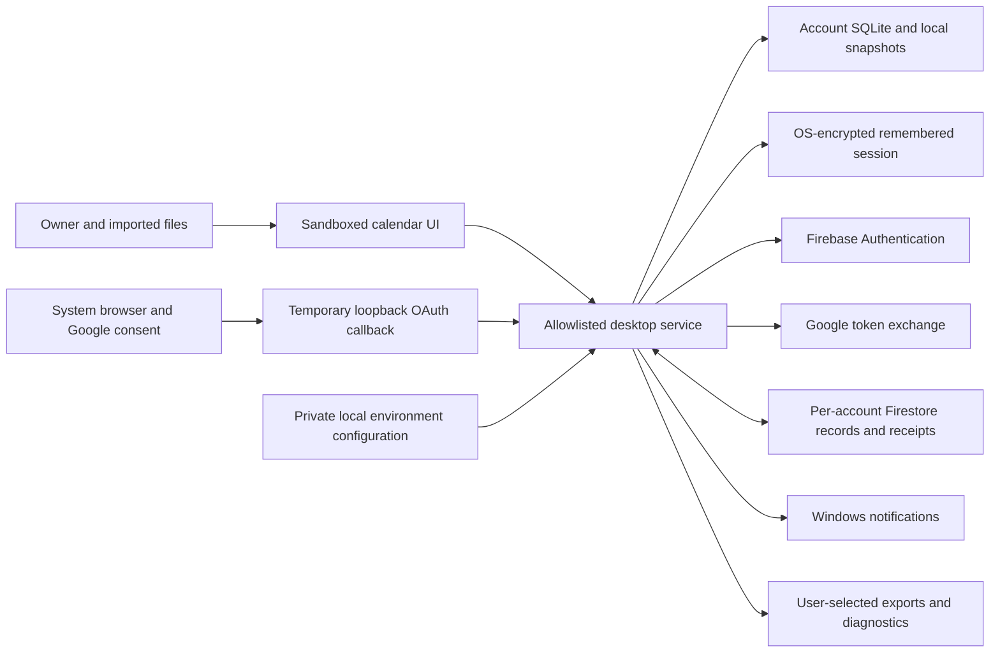

# C.C. Lime data and retention inventory

Engineering draft, updated September 28, 2026, source version 0.1.7. Data behavior retains 0.1.6's cleanup; the owner's installed 0.1.5 is separate and lacks it. Supports T-54/T-56/A-58/A-59. Reviewed against the code, not approved by the operator or counsel. This is not a published privacy notice or a legal compliance finding.

## Confirmed boundary

The operator is based in **Ontario, Canada**. The next release is **only for the owner**, not an invited pilot or public launch. The intended purpose is a personal university calendar; patient records and healthcare organization workflows are outside the confirmed product scope. The future legal operator, privacy contact, deputies and business model remain undecided. Owner-only distribution does not make existing internet-facing authentication/database endpoints private or demonstrate that signup is restricted to the owner.

Free-text titles, notes, locations and imported calendars can still contain information about other people or sensitive appointments. Treat that content as potentially sensitive. Do not infer PHIPA applicability from the app's name or audience. Counsel must assess the actual roles, purposes and contracts before healthcare use. [IPC guidance](https://www.ipc.on.ca/en/health-organizations/collection-use-and-disclosure-of-personal-health-information).

The inventory records purposes and safeguards for the PIPEDA review; its scope decision remains open. Named accountability, notices/consent, access/correction and complaints procedures still need an operator and approval. [OPC PIPEDA resources](https://www.priv.gc.ca/en/privacy-topics/privacy-laws-in-canada/the-personal-information-protection-and-electronic-documents-act-pipeda/).

## Data movement

The main process owns credentials and network/storage operations. The renderer receives calendar data and account display state through a narrow bridge, not refresh tokens. Local preview has no cloud sync; authenticated cloud calendars store data both locally and remotely. Provider transfers use HTTPS. No end-to-end encryption is implemented. Firestore's configured region is `northamerica-northeast2` (Toronto); this does **not** establish Canadian-only processing for authentication, Google, support, logs or provider subprocessors.

## Implemented holdings and lifecycle

`userData` means the operating system's private per-user C.C. Lime application directory. Account subdirectories use a truncated SHA-256 of account ID. That obscures the folder name; it does not encrypt content. Source links support engineering review, not an independent audit.

| Holding / purpose | Content, location and access | Actual retention / deletion | Gap / next verification |
| --- | --- | --- | --- |
| Calendar and preferences: display, scheduling and sync | Titles, notes, locations, times/zones, recurrence/exception/completion state, course/instructor and semester fields, imported source IDs, reminders and preferences. Plaintext `accounts/<hash>/calendar.sqlite`, WAL/SHM; active cloud records in the UID's Firestore collection. OS user and authorized provider administrators can access their respective stores. | No automatic age-based removal. Archive is not deletion. Item deletion produces a tombstone and sync mutation; historical copies can remain below. | Approve purposes/minimization and deletion notices. Verify copies and filesystem recovery risks. [Schema](../src/shared/model.ts), [store](../src/main/store.ts). |
| Durable sync state: delivery/conflicts/offline convergence | Outbox base/current values, shadows, conflict base/local/remote content, sequences, mutation IDs and metadata in SQLite. Cloud receipts/head/tombstones maintain acknowledgement and order. | Acknowledgement/conflict resolution remove relevant working rows; no general age purge of historical identifiers. Tombstones/receipts can persist for account lifetime. Account deletion removes cloud records/receipts/head. | Define stale-device reconciliation and safe compaction before shortening retention; never drop pending writes to meet a TTL. [Sync](../src/main/sync.ts), [cloud](../src/main/cloud.ts). |
| Quick undo: recover accidental edit/delete | Before-values and comparison digest in SQLite `undo`. | Undo usable for 10 seconds; exact expiry remains valid. From 0.1.6, delete rows strictly past expiry on account open, mutation housekeeping, undo attempts, ordinary snapshots and scheduler reconciliation. Expected SQLite failures retry later without rejecting saved changes. Earlier versions, including installed 0.1.5, leave expired rows. | Eight tests cover boundaries, restart, unrelated/account data, snapshots, mutation, idle timer and failed cleanup. Active/awake scheduler normally checks within 60 seconds, not a deadline during sleep, closed accounts or storage failure. Existing copies/WAL/free pages are not securely erased; rollout and wider retention remain open. [Tests](../tests/unit/retention.test.ts). |
| Import undo: reverse import | Before/after imported record payloads and creation time in SQLite `import_batches`. | No expiry or bounded count. Successful import undo removes the batch; item deletion does not necessarily erase this history. | Approve visible undo-retention window/count and test cleanup without breaking promised undo. |
| Reminder journal: delivery/retry/inbox | Title, item/occurrence/rule IDs, due times/state/snooze in `reminders`; minimal IDs/due times in `delivery_markers`. | Reconciliation prunes detailed rows older than 90 days by `due_ms`, except pending/snoozed/dispatching. Markers have no expiry. Inactive app/accounts do not run a background purge. | Review exceptions/marker need and long-offline deduplication. [Scheduler](../src/main/scheduler.ts). |
| Snapshots and recovery preservation | Full plaintext SQLite copies under account `backups`, including internal history. Recovery preserves replaced SQLite/WAL/SHM in `preserved-before-recovery-*`. | Keep 7 daily copies, 1 pre-migration and 3 per other label. Rotation happens when another same-label snapshot is created. Seven daily copies are **not a seven-day TTL**. Recovery quarantine has no purge. Local account removal includes these copies. | Approve maximum ages/quarantine review; test restoration first. [Recovery](../src/main/recovery.ts). |
| Remembered identity: restore sign-in | `session.enc`: project ID, refresh token and UID/email/name/providers/verification. OS `safeStorage` encryption; temporary encrypted `.new` during replacement. ID tokens/password requests processed in memory, not intentionally persisted as plaintext by the service. | Normal sign-out removes `session.enc` and clears the session. Failed restore can retain unreadable files; interrupted write can leave `.new`. | Test orphan encrypted-file lifecycle, token revocation and OS/backup access. Encryption does not defeat same-user malware. [Auth](../src/main/auth.ts). |
| Provider identity / Google sign-in | Firebase identifiers/email/profile/provider metadata and provider-handled credentials; optional Google consent/token exchange via browser and temporary loopback callback. OAuth state/PKCE/nonce ephemeral. | App requests Firebase identity deletion after cloud cleanup, not Google-account deletion. Browser cookies/history and provider security logs are outside app-local deletion. Provider retention not inventoried. | Obtain contractual retention/subprocessor evidence; test delivered verification/reset email and linking. Do not claim zero provider retention. |
| Device preferences / integration | `device.json` notification/startup/tray/privacy/zone/view choices, explanation markers, shortcut backups and Windows registration. | Device settings persist across sign-out/account removal. Shortcut backups persist. Broader install/uninstall tests pending. | Define device reset/uninstall behavior. Integration records can contain local paths. [Service](../src/main/service.ts), [Windows integration](../src/main/windows-integration.ts). |
| Windows notification display/history | Reminder title or generic notice; occurrence navigation context. Windows may retain history. Notifications initially off; separate privacy toggle initially off, can hide content when enabled. | Windows controls banner/history retention. Item deletion/sign-out does not demonstrate OS-history erasure. Native delivery requires a running installed app and suitable OS settings. | Review disclosure/onboarding, lock screen/history, real sleep/login tests. |
| Exports, backups and diagnostics | User-selected plaintext ICS/full JSON backup. Optional diagnostics: app/OS/runtime versions, record/pending/conflict counts, sync state, operation counters, notification/secure-storage flags; no titles, notes, tokens or email fields. | Remain until owner removes files. No auto-upload. Files may be in cloud-synced/external folders; account deletion does not find/remove them. | Test synthetic output contents; define support intake/access/retention before accepting diagnostic uploads. |
| Private configuration / developer evidence | OAuth JSON/environment variables under ignored `.local`; installed config under `userData/.local/.env` or injected environment. Excluded from source/package. Test reports may contain paths/synthetic data; real-profile evidence remains private. | No automatic credential expiry/removal; rotation/evidence retention require operator control. Uninstall does not revoke credentials. | Verify Git/archive exclusion each build. Repository is inside OneDrive on this machine: Git ignore does not exclude `.local` from filesystem sync/backups. Review local protection without publishing secrets. |
| Cloud deletion marker | Minimal immutable `system/deletion` marker under UID prevents old clients/tokens recreating records. | Retained after cloud record/receipt/head and identity deletion; no scheduled purge. | Approve purpose/duration; prove any expiry cannot resurrect data. Do not claim every cloud identifier erased. |

No advertising or automatic product analytics is implemented in current app code. This is not a claim that providers or Windows produce no operational logs. Provider retention, administrative access and backups need verified vendor inventory.

## Meaning of deletion actions

1. **Sign out:** stop session sync/reminders, close/hide account store, remove remembered session. Calendar and snapshots remain locally.
2. **Remove local data:** stop services, validate active account directory, close store and delete that directory with managed snapshots. Cloud data, user exports, device settings and private configuration remain.
3. **Delete account:** begin immutable cloud deletion marker; suspend normal changes; page through and verify deletion of records/receipts; remove sync head; request identity deletion; then remove active local account directory. Interruptions surface resumable state. Old offline devices, exports, OS backups/history and provider retention are not erased by this flow. Marker remains.
4. **Delete one item:** synchronize deletion; do not promise immediate erasure from undo/import/conflict/shadow history, snapshots or OS notifications.

Filesystem unlink and SQL removal are logical deletion, not proof of forensic erasure from SSDs, WAL/free pages, provider backups or external copies. Select encryption/media-disposal controls with the operator; no unverified secure-erase claim.

## Proposed decisions and acceptance

No universal retention period is imposed by this draft. Choose purpose-based limits and disposal methods covering copies as well as active records; review legal preservation obligations before implementation. [OPC retention guidance](https://www.priv.gc.ca/en/privacy-topics/privacy-for-businesses/appropriate-handling-of-personal-information/gd_rd_201406/).

| Decision | Proposed role, not appointed | Evidence required |
| --- | --- | --- |
| Expired quick undo | Engineering/operator | Implemented and tested in 0.1.6 source; boundary/reopen/idle/failure and snapshot-residue evidence recorded. Installed 0.1.5 has not received it. Broader retention approval and copies remain separate. |
| Import undo, snapshots/quarantine, inactive accounts | Privacy owner/engineering | Approved age/count/purpose, visible behavior, exceptions, migration/restore and measured removal. |
| Tombstones/receipts/deletion marker | Engineering/security/privacy | Offline/replay model, compaction protocol, expiry/resurrection tests, owner decision. |
| Provider identity/logs/backups | Operator/vendor reviewer | Contract/settings evidence, transfers/subprocessors, deletion propagation and exceptions; no invented TTL. |
| Requests/complaints | Privacy contact/counsel | Proportionate identity check; access/correction/export/deletion scope; third-party information handling; approved response commitments; private log and synthetic end-to-end exercise. |
| Devices/disposal/exports | Operator/security | Encryption/access inventory, recovery keys, exported-copy guidance, retirement/uninstall exercise. |

Approval record: legal operator **TBD**; privacy/security reviewers **TBD**; policy version/date **unapproved**; next approved review **TBD**. Revisit on field/vendor/storage/retention/audience/purpose changes. See [risk register](RISK_REGISTER.md). T-54/T-56 remain open.
