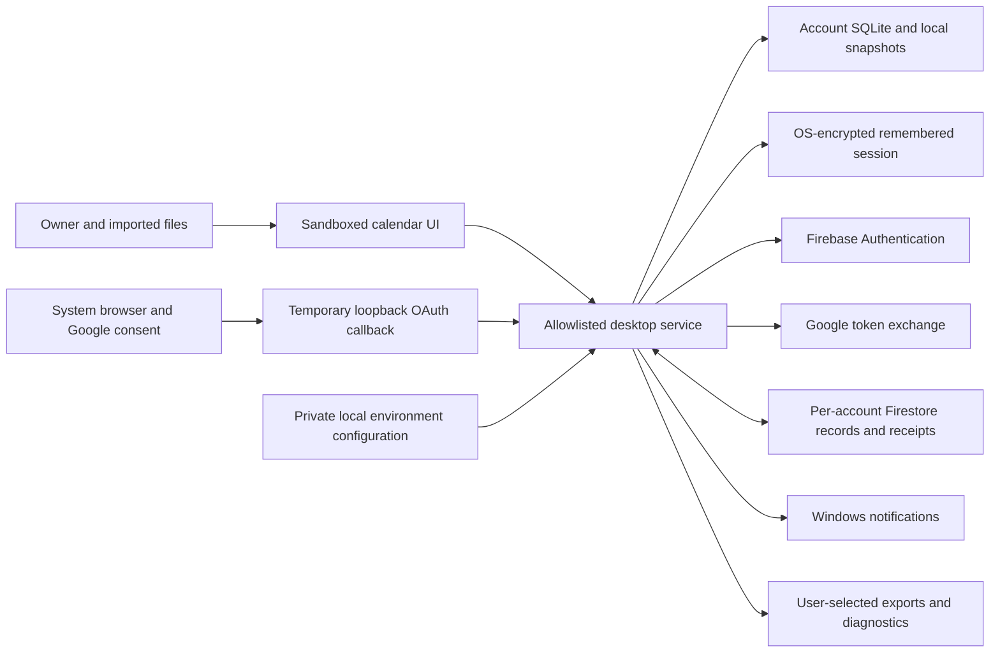

# C.C. Lime data and retention inventory

## October 3 staged authenticator/passkey data flows

The [MFA candidate](MFA_IMPLEMENTATION_EVIDENCE.md) introduces source support for Firebase native authenticator enrollment/sign-in and a proposed Cloudflare Workers/D1 passkey verifier. Cloudflare resources have not been created and the owner's data has not been sent there. Native TOTP setup key/session/QR stays temporarily in main/renderer memory, clears on completion/cancel/account change/expiry and never enters snapshots, SQLite, calendar backup, diagnostics or browser URLs. No remote QR service is used.

The proposed server data consists of Firebase UID, random RP user handle, public credential ID/key, counter/revision/backup properties, bounded name/timestamps, short-lived proof-bound ceremony records and HMAC-derived IP/hashed-UID quota buckets. Private passkey keys and biometric data stay in the authenticator. Signed Firebase identity/custom tokens are transient; the desktop's remembered refresh token remains protected by OS secure storage under existing semantics. Server signing credentials belong only in approved secret bindings, never desktop files/distribution.

Hourly cleanup removes expired flows/quota buckets and reconciles deleted Firebase identities. Confirmed deletion purges public credentials/labels and bound flows; a minimal server UID/handle/epoch/cutoff tombstone and Firestore denial marker remain for 24 hours before rechecked erasure. Provider outages preserve pending retry state rather than pretending deletion succeeded. Fair 20-account batches and the owner-only pilot limits are technical bounds, not a guaranteed deletion deadline under outage. Vendor backups, D1 Time Travel, privileged secret custody, hosting locations/cross-border notices and approved retention/legal review remain open under [the deployment proposal](MFA_GATEWAY_DEPLOYMENT_REVIEW.md). No PHIPA scope or formal compliance claim is added.

## October 2 installed 0.1.16 update

The [new release](RELEASE_0116_PLAN.md) installs the authentication-cleanup and protocol/frame controls described below; the earlier source-only paragraph is historical. No new calendar personal-data field, analytics or vendor is added. A fresh private verified backup preserves 108 normal profile files, both account databases and 35 records. All account records and non-cache files/private configuration match after installation. This is another plaintext retained backup requiring an approved retention decision, not encrypted off-device recovery.

Actual installed-byte email/password tests use one disposable identity and separate profile: sign-in, encrypted remembered session, normal restart, sign-out and fresh signed-out restart pass, with three normal exits and verified identity/data/configuration cleanup. Fresh/restarted configured email/Google/reset controls pass against physically verified normal installation/configuration; this does not prove inbox delivery or a new Google consent exchange. [Implementation evidence](IMPLEMENTATION_STATUS.md) retains exact results, including failed verification-helper assumptions. Operator/contact/retention/legal approvals remain pending; PHIPA remains excluded.

## October 2 source-only authentication cleanup

Uninstalled source removes orphan `session.enc.new` files without promoting them. Ordinary sign-out removes both committed encrypted session and staging file. If storage removal fails, the account is still cleared from memory and the renderer notified; a fixed non-secret `session.enc.signed-out` marker containing `1` is attempted, preventing old-session adoption on restart and triggering another cleanup attempt. Successful explicit sign-in atomically persists a fresh encrypted session and removes the marker. Filesystem failures can prevent local cleanup; this does not claim erasure from snapshots/backups or protect a compromised OS account. The marker has no account identifier, password or token, does not sync and does not enter calendar backups.

OAuth codes/state/error and temporary sockets remain memory-only with bounded resources and non-reflecting responses. No new calendar personal-data field, analytics or vendor is introduced. Live tests used generated identities/profiles with independently verified cleanup; owner profile and installed 0.1.15 remain unchanged. The [draft notice/rights procedure](PRIVACY_RIGHTS_PROCEDURE.md) awaits operator/contact/retention and legal approval; it is not a published policy.

## October 1 installed 0.1.15 update

The task visibility/range/repetition changes are now installed under the [release plan](RELEASE_0115_PLAN.md). They add no new personal-data field or external service. A fresh ignored private normal-profile backup preceded installation; both account databases, 34 calendar records, 106 non-cache profile files and private sign-in configuration were preserved. Synthetic acceptance profiles and cloud identities were separate from the owner profile; all live test identities/data were deleted. The approved additive rules retain account ownership, verified-email and write-quota requirements. Exact observations and artifact identities are in [implementation evidence](IMPLEMENTATION_STATUS.md).

The private upgrade backup is another retained copy requiring an operator-approved retention/disposal decision; preservation does not establish encrypted independent backup or recovery objectives. Existing photos, completion ledger, deleted records/tombstones and old backups retain their documented lifecycle. No purge, recovery of deleted history or legal compliance claim is made. Ontario operator details, approved notices/rights procedures, retention and local-calendar encryption remain outstanding; PHIPA remains withdrawn. Earlier source-only statements below describe their dated checkpoints.

## October 1 source-only task display update

Installed/retained version remains 0.1.14. Unreleased task-history/range/weekly-progress changes read existing item, exception, occurrence-state and completion-timestamp records; they introduce no new personal-data field, external endpoint or purge. Older completions are now displayed independently of calendar hiding and the former task window. Infinite repeating schedules retain a disclosed six-month forward display horizon. Account change resets the task range/course selection; account data boundaries and the existing completion ledger remain in force. No owner database or backup was inspected or modified by synthetic acceptance tests. Retention, old backups/tombstones, local calendar encryption and operator-approved notices remain open; improved visibility is not recovery of previously deleted records. See [task plan](TASK_COMPLETION_RANGE_PLAN.md) and [implementation evidence](IMPLEMENTATION_STATUS.md).

## September 30: 0.1.13 presentation and scope update

Circular crop and avatar presentation introduce no new personal-data field and do not rewrite saved photo bytes. The bounded 128×128 PNG and existing draft, sync and backup lifecycle remain unchanged. The owner withdrew PHIPA from the current requirements on September 30, 2026; PIPEDA and the documented retention work remain active.

## 0.1.11 crop and password changes

Photo editing retains one bounded decoded source image temporarily in main-process memory and sends a metadata-free preview plus opaque token to the renderer. Cancel, account transition, navigation away or a ten-minute timeout clears the draft. Only the explicitly saved 128×128 icon enters the existing profile/outbox/cloud/snapshot lifecycle. Source file paths and original photos are not persisted. Username uses the existing private profile-name field and is not a new login identifier.

Current/new/confirmation passwords exist transiently in form state and the IPC/auth operation. Current and new passwords go directly to Firebase's authentication API over HTTPS; confirmation stays within the app's validation. Password strength feedback runs locally; passwords are not submitted to a scoring service, stored in SQLite/backups/diagnostics or logged. The rotated refresh token uses the existing OS-encrypted session file. Password fields clear after success or leaving the form; current-password fields also clear after failed update attempts. Comprehensive breach screening and provider policy enforcement remain follow-ups.

Previous profile-preservation checks below concerned the tool-launched redirected profile; the normal desktop profile is separate, as corrected in [implementation evidence](IMPLEMENTATION_STATUS.md). A future upgrade must freshly back up and compare the normal profile through Explorer's actual filesystem context.

## September 30 profile and appearance extension

Current source and owner installation 0.1.10; private profile/settings preservation passed. This supersedes the older version summary below. The user explicitly chose account sync for photo, display name and themes.

| Added holding | Purpose, location and lifecycle |
| --- | --- |
| Display name and resized profile photo | Personalization; one fixed account-owned record in SQLite, its ordinary outbox/shadow history and Firestore. Native PNG/JPEG selection is bounded to 5 MiB and 4,096-pixel dimensions, converted to a 128-pixel PNG with a 100,000-character limit. Original path/metadata are not stored. Removing a current photo does not erase older snapshots or exports. |
| Joined date | Identity-provider creation date in the encrypted remembered session and profile when available. Old offline sessions may show unavailable; local tracking start is labelled separately. |
| Color presets and up to three palettes | Account preferences in the same profile record, synced and included in backups; no device credentials. |
| Lifetime completion ledger | Minimal deterministic item/occurrence IDs, occurrence date and completion timestamp; no copied titles/notes. Retained after item deletion to count unique lifetime progress, across restart and sync. Existing completed tasks can be backfilled; previously deleted history cannot be reconstructed. |

Existing account deletion removes these cloud records through the same deletion protocol; live synthetic deletion was verified. Full backups and automatic snapshots can retain prior copies and are not encrypted by the application. Same-account format-2 backup merges include profile/history; calendar-copy transfers exclude them. Local preview stays on this computer. No public profile-photo hosting is introduced. Retention duration, old snapshot/export disposal and operator notices remain open decisions before broader distribution. Legal scope and certification statements below remain unchanged.

Engineering draft, updated September 29, 2026, source version 0.1.9 and installed version 0.1.8. The 0.1.9 native patch/notice repair does not change calendar data or retention behavior. The owner upgrade includes 0.1.6's expired-undo cleanup. A private local pre-upgrade profile copy is retained for recovery; its retention decision remains open. Supports T-54/T-56/A-58/A-59. Reviewed against the code, not approved by the operator or counsel. This is not a published privacy notice or a legal compliance finding.

## Confirmed boundary

The operator is based in **Ontario, Canada**. The next release is **only for the owner**, not an invited pilot or public launch. The intended purpose is a personal university calendar; patient records and healthcare organization workflows are outside the confirmed product scope. The future legal operator, privacy contact, deputies and business model remain undecided. Owner-only distribution does not make existing internet-facing authentication/database endpoints private or demonstrate that signup is restricted to the owner.

Free-text titles, notes, locations and imported calendars can still contain information about other people or sensitive appointments. Treat that content as potentially sensitive. The owner excluded PHIPA from the current student-calendar scope on September 30, 2026. Patient-record and healthcare organization workflows remain outside this product.

The inventory records purposes and safeguards for the PIPEDA review; its scope decision remains open. Named accountability, notices/consent, access/correction and complaints procedures still need an operator and approval. [OPC PIPEDA resources](https://www.priv.gc.ca/en/privacy-topics/privacy-laws-in-canada/the-personal-information-protection-and-electronic-documents-act-pipeda/).

## Data movement

The main process owns credentials and network/storage operations. The renderer receives calendar data and account display state through a narrow bridge, not refresh tokens. Local preview has no cloud sync; authenticated cloud calendars store data both locally and remotely. Provider transfers use HTTPS. No end-to-end encryption is implemented. Firestore's configured region is `northamerica-northeast2` (Toronto); this does **not** establish Canadian-only processing for authentication, Google, support, logs or provider subprocessors.

## Implemented holdings and lifecycle

`userData` means the operating system's private per-user C.C. Lime application directory. Account subdirectories use a truncated SHA-256 of account ID. That obscures the folder name; it does not encrypt content. Source links support engineering review, not an independent audit.

| Holding / purpose | Content, location and access | Actual retention / deletion | Gap / next verification |
| --- | --- | --- | --- |
| Calendar and preferences: display, scheduling and sync | Titles, notes, locations, times/zones, recurrence/exception/completion state, course/instructor and semester fields, imported source IDs, reminders and preferences. Plaintext `accounts/<hash>/calendar.sqlite`, WAL/SHM; active cloud records in the UID's Firestore collection. OS user and authorized provider administrators can access their respective stores. | No automatic age-based removal. Archive is not deletion. Item deletion produces a tombstone and sync mutation; historical copies can remain below. | Approve purposes/minimization and deletion notices. Verify copies and filesystem recovery risks. [Schema](../src/shared/model.ts), [store](../src/main/store.ts). |
| Durable sync state: delivery/conflicts/offline convergence | Outbox base/current values, shadows, conflict base/local/remote content, sequences, mutation IDs and metadata in SQLite. Cloud receipts/head/tombstones maintain acknowledgement and order. | Acknowledgement/conflict resolution remove relevant working rows; no general age purge of historical identifiers. Tombstones/receipts can persist for account lifetime. Account deletion removes cloud records/receipts/head. | Define stale-device reconciliation and safe compaction before shortening retention; never drop pending writes to meet a TTL. [Sync](../src/main/sync.ts), [cloud](../src/main/cloud.ts). |
| Quick undo: recover accidental edit/delete | Before-values and comparison digest in SQLite `undo`. | Undo usable for 10 seconds; exact expiry remains valid. From 0.1.6, delete rows strictly past expiry on account open, mutation housekeeping, undo attempts, ordinary snapshots and scheduler reconciliation. Expected SQLite failures retry later without rejecting saved changes. Earlier versions through 0.1.5 leave expired rows; the owner now has 0.1.8. | Eight tests cover boundaries, restart, unrelated/account data, snapshots, mutation, idle timer and failed cleanup. Active/awake scheduler normally checks within 60 seconds, not a deadline during sleep, closed accounts or storage failure. Existing copies/WAL/free pages are not securely erased; wider retention remains open. [Tests](../tests/unit/retention.test.ts). |
| Import undo: reverse import | Before/after imported record payloads and creation time in SQLite `import_batches`. | No expiry or bounded count. Successful import undo removes the batch; item deletion does not necessarily erase this history. | Approve visible undo-retention window/count and test cleanup without breaking promised undo. |
| Reminder journal: delivery/retry/inbox | Title, item/occurrence/rule IDs, due times/state/snooze in `reminders`; minimal IDs/due times in `delivery_markers`. | Reconciliation prunes detailed rows older than 90 days by `due_ms`, except pending/snoozed/dispatching. Markers have no expiry. Inactive app/accounts do not run a background purge. | Review exceptions/marker need and long-offline deduplication. [Scheduler](../src/main/scheduler.ts). |
| Snapshots and recovery preservation | Full plaintext SQLite copies under account `backups`, including internal history. Recovery preserves replaced SQLite/WAL/SHM in `preserved-before-recovery-*`. | Keep 7 daily copies, 1 pre-migration and 3 per other label. Rotation happens when another same-label snapshot is created. Seven daily copies are **not a seven-day TTL**. Recovery quarantine has no purge. Local account removal includes these copies. | Approve maximum ages/quarantine review; test restoration first. [Recovery](../src/main/recovery.ts). |
| Remembered identity: restore sign-in | `session.enc`: project ID, refresh token and UID/email/name/providers/verification. OS `safeStorage` encryption; temporary encrypted `.new` during replacement. ID tokens/password requests processed in memory, not intentionally persisted as plaintext by the service. | Normal sign-out removes `session.enc` and clears the session. Failed restore can retain unreadable files; interrupted write can leave `.new`. | Test orphan encrypted-file lifecycle, token revocation and OS/backup access. Encryption does not defeat same-user malware. [Auth](../src/main/auth.ts). |
| Provider identity / Google sign-in | Firebase identifiers/email/profile/provider metadata and provider-handled credentials; optional Google consent/token exchange via browser and temporary loopback callback. OAuth state/PKCE/nonce ephemeral. | App requests Firebase identity deletion after cloud cleanup, not Google-account deletion. Browser cookies/history and provider security logs are outside app-local deletion. Provider retention not inventoried. | Obtain contractual retention/subprocessor evidence; test delivered verification/reset email and linking. Do not claim zero provider retention. |
| Device preferences / integration | `device.json` notification/startup/tray/privacy/zone/view choices, explanation markers, shortcut backups and Windows registration. | Device settings persist across sign-out/account removal. Shortcut backups persist. Broader install/uninstall tests pending. | Define device reset/uninstall behavior. Integration records can contain local paths. [Service](../src/main/service.ts), [Windows integration](../src/main/windows-integration.ts). |
| Windows notification display/history | Reminder title or generic notice; occurrence navigation context. Windows may retain history. Notifications initially off; separate privacy toggle initially off, can hide content when enabled. | Windows controls banner/history retention. Item deletion/sign-out does not demonstrate OS-history erasure. Native delivery requires a running installed app and suitable OS settings. | Review disclosure/onboarding, lock screen/history, real sleep/login tests. |
| Exports, backups and diagnostics | User-selected plaintext ICS/full JSON backup. Optional diagnostics: app/OS/runtime versions, record/pending/conflict counts, sync state, operation counters, notification/secure-storage flags; no titles, notes, tokens or email fields. | Remain until owner removes files. No auto-upload. Files may be in cloud-synced/external folders; account deletion does not find/remove them. | Test synthetic output contents; define support intake/access/retention before accepting diagnostic uploads. |
| Private configuration / developer evidence | OAuth JSON/environment variables under ignored `.local`; installed config under `userData/.local/.env` or injected environment. Excluded from source/package. Test reports may contain paths/synthetic data; real-profile evidence remains private. | No automatic credential expiry/removal; rotation/evidence retention require operator control. Uninstall does not revoke credentials. | Verify Git/archive exclusion each build. Repository is inside OneDrive on this machine: Git ignore does not exclude `.local` from filesystem sync/backups. Review local protection without publishing secrets. |
| Cloud deletion marker | Minimal immutable `system/deletion` marker under UID prevents old clients/tokens recreating records. | Retained after cloud record/receipt/head and identity deletion; no scheduled purge. | Approve purpose/duration; prove any expiry cannot resurrect data. Do not claim every cloud identifier erased. |

No advertising or automatic product analytics is implemented in current app code. This is not a claim that providers or Windows produce no operational logs. Provider retention, administrative access and backups need verified vendor inventory.

## Meaning of deletion actions

1. **Sign out:** stop session sync/reminders, close/hide account store, remove remembered session. Calendar and snapshots remain locally.
2. **Remove local data:** stop services, validate active account directory, close store and delete that directory with managed snapshots. Cloud data, user exports, device settings and private configuration remain.
3. **Delete account:** begin immutable cloud deletion marker; suspend normal changes; page through and verify deletion of records/receipts; remove sync head; request identity deletion; then remove active local account directory. Interruptions surface resumable state. Old offline devices, exports, OS backups/history and provider retention are not erased by this flow. Marker remains.
4. **Delete one item:** synchronize deletion; do not promise immediate erasure from undo/import/conflict/shadow history, snapshots or OS notifications.

Filesystem unlink and SQL removal are logical deletion, not proof of forensic erasure from SSDs, WAL/free pages, provider backups or external copies. Select encryption/media-disposal controls with the operator; no unverified secure-erase claim.

## Proposed decisions and acceptance

No universal retention period is imposed by this draft. Choose purpose-based limits and disposal methods covering copies as well as active records; review legal preservation obligations before implementation. [OPC retention guidance](https://www.priv.gc.ca/en/privacy-topics/privacy-for-businesses/appropriate-handling-of-personal-information/gd_rd_201406/).

| Decision | Proposed role, not appointed | Evidence required |
| --- | --- | --- |
| Expired quick undo | Engineering/operator | Implemented and tested from 0.1.6; boundary/reopen/idle/failure and snapshot-residue evidence recorded. Installed through the verified 0.1.8 owner upgrade. Broader retention approval and copies remain separate. |
| Import undo, snapshots/quarantine, inactive accounts | Privacy owner/engineering | Approved age/count/purpose, visible behavior, exceptions, migration/restore and measured removal. |
| Tombstones/receipts/deletion marker | Engineering/security/privacy | Offline/replay model, compaction protocol, expiry/resurrection tests, owner decision. |
| Provider identity/logs/backups | Operator/vendor reviewer | Contract/settings evidence, transfers/subprocessors, deletion propagation and exceptions; no invented TTL. |
| Requests/complaints | Privacy contact/counsel | Proportionate identity check; access/correction/export/deletion scope; third-party information handling; approved response commitments; private log and synthetic end-to-end exercise. |
| Devices/disposal/exports | Operator/security | Encryption/access inventory, recovery keys, exported-copy guidance, retirement/uninstall exercise. |

Approval record: legal operator **TBD**; privacy/security reviewers **TBD**; policy version/date **unapproved**; next approved review **TBD**. Revisit on field/vendor/storage/retention/audience/purpose changes. See [risk register](RISK_REGISTER.md). T-54/T-56 remain open.
