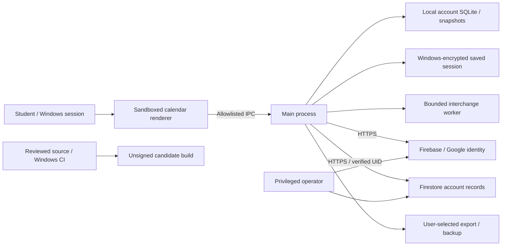

# Proposed security operating program

Prepared October 1, 2026. **Draft for operator approval, not an operating control or certification.** Ontario, owner-only pilot; personal university calendar, no patient-record service. The operator's legal identity, privacy contact, accountable security/incident owner and recovery deputy must be recorded privately before adoption. The [checklist](COMPLIANCE_CHECKLIST.md) distinguishes implementation evidence from approval and operational evidence.

## System description for scope review

The Windows desktop application presents calendar, task, course, profile and appearance views. A sandboxed renderer calls an allowlisted main-process bridge. Main-process validation, local action limits, image conversion and isolated interchange workers precede local SQLite writes. Local account folders, outbox, sync receipts/shadow state, conflict records and automatic snapshots support offline use and recovery. Device preferences are separate from account-synced preferences. Local calendar databases and exported backups are plaintext; Windows protects remembered refresh tokens through safeStorage. Neither client-side limits nor token encryption protect a fully compromised logged-in Windows account.

Email/password identities use Firebase authentication; Google desktop OAuth uses an owned loopback callback, PKCE, state and nonce. HTTPS main-process requests synchronize only the verified account's Firestore records. Deletion uses a recent-authentication marker and resumable bounded cleanup. Cloud rules enforce ownership/schema, commit groups and accepted-write quotas. Provider administration bypasses ordinary account rules and needs separate privileged-access controls. There is no deployed public website or custom read/auth gateway. No general server-side read or account/IP authentication budget is claimed.

Provider database location observed in Montreal does not establish all identity, log, support or subprocessors' residency. User exports, upgrade copies and OneDrive may introduce additional locations and access. GitHub contains public source; ignored private configuration and restricted evidence must never be uploaded as release/test artifacts. This description requires operator/vendor confirmation before it can support a SOC engagement.

## Proposed duties, intervals and acceptance

These defaults are a concrete approval proposal. Dates, owners, spending and risk acceptance remain unset. No scheduled automation or provider change is created by this document.

| Control | Proposed execution | Evidence needed to call it operating |
| --- | --- | --- |
| Governance | Approve scope, owners, objectives and this program; review quarterly and when audience/data/vendor/architecture changes | Signed version, named accountable owner/deputy, decisions and next review |
| Access | Individual admin identities; verified MFA/recovery; routine least privilege; review monthly and after joins/changes/leavers | Private principal register, effective roles, factor/recovery attestation, independent review and harmless denial/revocation test |
| Development | Reviewed branch/PR, exact pinned dependencies/action commits, credential scans, clean dependency gate, type/unit/cloud/desktop tests; preserve original coverage | Effective protections and failed unreviewed updates; source/check identities, artifact digests, reviewer and release approval |
| Vulnerabilities | Review provider/vendor advisories weekly and on alert; same-day triage of credible active exploitation; proposed fix targets: exploited/critical 72 hours, high 7 days, medium 30 days, low 90 days | Impact/reachability record, owner/deadline, repair/retest or explicit time-bounded risk decision; no automatic exception for development/native code |
| Device protection | Supported patched OS, screen lock, approved software, disk encryption/recovery custody and endpoint protection for every privileged device | Actual configuration and recovery drill; agent cannot attest owner settings or install organization monitoring by assumption |
| Cloud abuse | Adopt the separate provider-password proposal and read/auth budget architecture only after explicit rollout/capacity decision | Measured direct-endpoint denials, shared-IP usability, legitimate recovery/deletion behavior and alert drill |
| Release | Versioned candidate only after native/OS/account acceptance; signing identity/custody/budget and protected distribution | Exact packaged/installed artifact and signature identities, clean/populated upgrades, second-PC results; no unsigned fallback labelled signed |
| Privacy | Approve purpose/notice/contact/vendor terms, minimization and store-specific retention; process verified requests through the rights procedure | Published approved notice, lawful scope review, consent record where needed, timed access/correction/deletion/complaint exercise across live stores and retained copies |
| Recovery | Select RPO/RTO/maximum outage from business impact; independent encrypted backup with separately recoverable key and off-device custody | Timed end-to-end restore with exact record/outbox/profile/history integrity, failure handling and quarterly sampling; sync is not an independent backup |
| Incidents | Exercise the incident runbook annually and after major changes; test contact/deputy access and alternate communication | Human tabletop attendance/times/decisions, evidence custody, qualified legal notification decision and corrective-action retest |
| Assurance | Management review of exceptions/metrics quarterly; independent assessment against the approved normative scope/period | Management approval and corrective actions; CPA SOC report, ISO certification and DGSI assessment only if actually procured and issued |

## Metrics and evidence custody

Each control record contains: identifier, approved scope/version, named performer and reviewer, UTC start/end, source/resource/artifact identity, expected result, observed result, failure/exception, related risk, corrective owner/deadline and next review. Record real failures and superseded evidence. Do not turn an evidence template into a completed control.

Suggested metrics: dependency findings by impact/age; reviewed-release gate failures; unresolved privileged-access exceptions; authentication/Firestore denial rates and recovery behavior; backup drill RPO/RTO against approved objectives; privacy-request due dates; incident action closure; overdue policy/training reviews. Failed or inaccessible measurement is unknown, not zero. Publish only aggregate sanitized summaries. Calendar content, tokens, identity proof, sensitive incidents and restricted audit reports belong in operator-approved private storage with access, encryption, retention and legal-hold controls. Proposed evidence retention is one full chosen assessment period plus reviewer needs; the operator must approve actual durations before collection or purge.

## Operator training package

Before privileged access, and proposed annually thereafter: recognize impersonation/phishing, verify provider domains through known bookmarks, use individual credentials and a password manager, verify MFA/recovery custody, protect devices and exports, use synthetic test data, review dependency/release evidence, avoid calendar/token content in logs, escalate suspected compromise immediately through [incident procedures](INCIDENT_CONTINUITY.md), and handle rights requests without requesting a password. Include contractors with equivalent access. Do not conduct deceptive phishing simulations or send messages without separate authorization.

Proposed knowledge check (all answers required; retrain wrong answers):

1. Can an emailed MFA-recovery request authorize sharing a recovery code? **No; verify through the established contact path and never share the secret.**
2. Does a clean npm audit prove the Electron/native binary is secure? **No; inspect native provenance/advisories and remaining acceptance.**
3. Does cloud sync replace a backup? **No; deletion and corruption can propagate.**
4. Can a disposable cloud test account be abandoned after a failed test? **No; verify account/data/configuration cleanup independently and retain sanitized failure evidence.**
5. Can a reviewed installer be published despite failing required sign-in or native acceptance? **No; repair/retest or obtain an explicit scope/risk decision before release.**
6. Where should suspected credential exposure be recorded? **In restricted incident evidence with a reference in the public register, never the credential itself.**

Private attendance record: person/role, curriculum version, completion date, score, corrective training, reviewer and next due date. No actual attendance or pass is asserted.

## Approval and management review packet

Review [risk register](RISK_REGISTER.md), [data inventory](PRIVACY_DATA_INVENTORY.md), [access proposal](ACCESS_GOVERNANCE.md), [abuse decisions](ABUSE_THREAT_MODEL.md), [incident/recovery drafts](INCIDENT_CONTINUITY.md), [signing proposal](SIGNING_DECISION.md), standards mappings and the current checklist together. Record approval, changes, resources, unresolved risks and corrective actions for each control. An operator signature cannot substitute for independent assurance or technical negative tests; an automated test cannot approve legal applicability, resources or risk.
